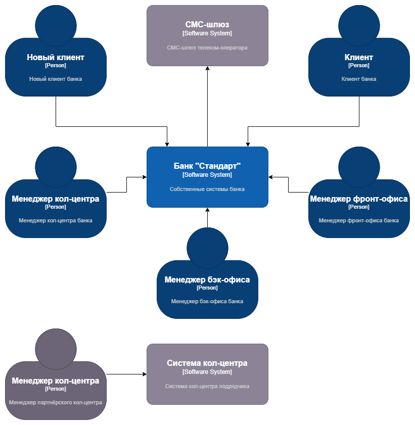
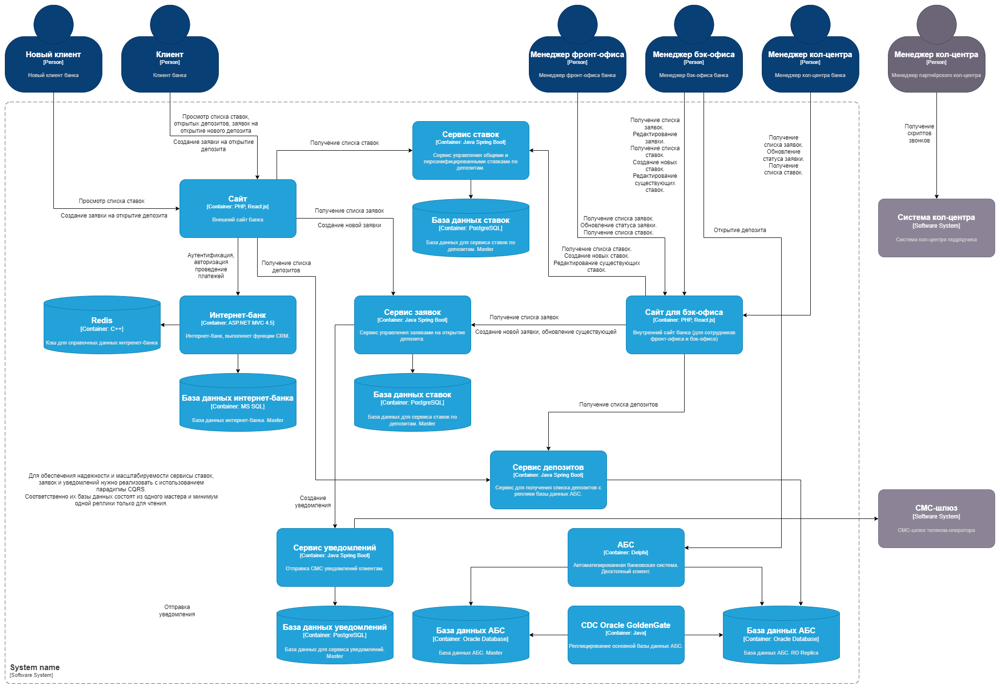

### **Название задачи:** Открытие депозитов онлайн
### **Автор:** Заливочкин А.В.
### **Дата:** 07.03.2025
### **Функциональные требования**

| **№** | **Действующие лица или системы**                 | **Use Case**                                                                                                                         | **Описание**                                                                                               |
|:-----:|:-------------------------------------------------|:-------------------------------------------------------------------------------------------------------------------------------------|:-----------------------------------------------------------------------------------------------------------|
|   1   | Новый клиент, сайт                               | Отображение на сайте списка доступных депозитов с актуальными ставками для нового клиента                                            |                                                                                                            |
|   2   | Новый клиент, сайт, сервис заявок                | Возможность для нового клиента подать заявку на депозит, оставив свой номер телефона и ФИО                                           | 1. Новый клиент заполняет и отправляет форму на сайте                                                      |
|       |                                                  |                                                                                                                                      | 2. Сформированная заявка сохраняется в сервисе заявок                                                      |
|       |                                                  |                                                                                                                                      | 3. Менеджерам кол-центра отправляется сообщение о поступлении новой заявки                                 |
|   3   | Новый клиент, менеджер кол-центра, сервис заявок | Заявка на депозит для нового клиента должна попадать к менеджеру кол-центра. Изучив заявку, менеджер может предложить особые условия | 1. Менеджер кол-центра изучает заявку и выбирает тариф и другие условия                                    |
|       |                                                  |                                                                                                                                      | 2. Менеджер кол-центра перезванивает новому клиенту и озвучивает условия                                   |
|       |                                                  |                                                                                                                                      | 3. Новый клиент приходит в офис для оформления                                                             |
|   4   | Клиент банка, интернет-банк                      | В интернет-банке клиент видит список доступных депозитов с актуальными ставками и персонализированные ставки                         |                                                                                                            |
|   5   | Клиент банка, интернет-банк, сервис заявок       | Указав счёт и сумму депозита, клиент может подать заявку на открытие депозита                                                        | 1. Клиент заполняет и отправляет форму в интернет-банке                                                    |
|       |                                                  |                                                                                                                                      | 2. Интернет-банк создаёт заявку в сервисе заявок                                                           |
|       |                                                  |                                                                                                                                      | 3. Интернет-банк отправляет клиенту СМС для подтверждения создания заявки                                  |
|       |                                                  |                                                                                                                                      | 4. Клиент в интернет-банке вводит код, полученный в СМС                                                    |
|       |                                                  |                                                                                                                                      | 5. Менеджерам бэк-офиса отправляется сообщение о поступлении новой заявки                                  |
|   6   | Менеджер бэк-офиса, АБС, сервис заявок           | Заявку на открытие депозита обработает менеджер в бэк-офисе                                                                          | 1. Менеджер бэк-офиса обрабатывает заявку и открывает депозит в АВС                                        |
|       |                                                  |                                                                                                                                      | 2. Менеджер бэк-офиса вносит актуальную ставку в заявку в сервисе заявок и помечает заявку как выполненную |
|       |                                                  |                                                                                                                                      | 3. Сервис заявок отсылает клиенту СМС с информацией об открытии депозита и актуальной ставкой              |
### **Нефункциональные требования**

| **№** | **Требование**                                                                                                                                                                   |
|:-----:|:---------------------------------------------------------------------------------------------------------------------------------------------------------------------------------|
|   1   | Интерфейс работы сайта и интернет-банка должен быть максимально удобным для клиента                                                                                              |
|   2   | Отклик по всем операциям должен быть максимально быстрым и занимать миллисекунды                                                                                                 |
|   3   | Нужно придерживаться системы дизайна для приложений, которая принята в компании. Пользователи при работе должны видеть привычные цвета и брендированные элементы                 |
|   4   | Все сервисы должны работать 24/7 и быть доступны в 99,9% случаев                                                                                                                 |
|   5   | В случае сбоев в ЦОД необходимо, чтобы сервисы интернет-банка были доступны и выдерживали требуемую нагрузку                                                                     |
|   6   | Нужно предусмотреть равномерное горизонтальное масштабирование и распределение запросов между серверами, приложениями и ЦОД                                                      |
|   7   | Если отсутствует, то нужно внедрить систему создания и хранения бэкапов баз данных                                                                                               |
|   8   | Нужно добавить систему кеширования для справочных данных                                                                                                                         |
|   9   | Для АБС нужно настроить реплики только для чтения используя, например, Oracle GoldenGate                                                                                         |
|  10   | При доработках во всех системах нужно использовать технологии, которые уже есть в банке (или новые технологии должны быть совместимы с существующими платформами разработки)     |
|  11   | Желательно, чтобы внутри банка уже была экспертиза — сотрудники понимали новые технологии хотя бы на уровне языков программирования                                              |
|  12   | Если отсутствует, то нужно внедрить систему многоуровневого тестирования                                                                                                         |
|  13   | Нужно предусмотреть разработку документации для дальнейшего расширения системы                                                                                                   |
|  14   | Все внешние коммуникации должны быть защищены на транспортном уровне - нужно использовать https                                                                                  |
|  15   | Нужно избежать прямой работы интернет-банка с API АБС в новом процессе (онлайн-подача заявок на большое количество продуктов может поставить под угрозу работоспособность банка) |
|  16   | Базы данных ограничены PostgreSQL, MS SQL и Oracle                                                                                                                               |
|  17   | Языки и платформы разработки ограничены ASP.NET MVC 4.5 на основе .NET Framework 4.5, Delphi, PHP, React.js, Java Spring Boot                                                    |
|  18   | Требуется программное обеспечение для оркестровки контейнеризированных приложений (kubernetes, openshift или подобные) и специалисты по работе с ними                            |
|  19   | Для новых баз данных нужно предусмотреть разделение на персональные данные клиентов и остальные данные (либо шифровать целиком)                                                  |
### **Решение**
Решение основывается на ключевых требованиях: высокая доступность, надёжность и удобство использования.
Поэтому практически вся новая функциональность реализуется в новых микросервисах, изначально поддерживающих горизонтальное масштабирование.
Новых микросервисов всего четыре (плюс внутренний сайт) и каждый реализует достаточно узкую задачу - их реализация по силам существующей команде банка.

Доработок существующей системы две:
- интернет банк - доработка очень небольшая: добавление поддержки кеширования справочных данных, и тоже может быть реализована имеющимися силами
- АБС - внедрение парадигмы CQRS для снижения нагрузки на БД; возможность реализации нужно уточнить у разработчиков АБС

Новая технология всего одна - Oracle GoldenGate.
Но это высокоуровневый инструмент, требующий минимального вмешательства разработчиков, так что его внедрение не должно вызвать сложностей.

Требование шифрования баз данных пока не учитывается, так как цель создать MVP, и оставлено на следующий этап.

Диаграмма контекста

  

Диаграмма контейнеров

  

### **Альтернативы**
В качестве альтернативы можно всю новую функциональность реализовать в виде модульного монолита с единой базой данных и без парадигмы CQRS.
Но и в этом случае нужно обеспечить максимальную независимость модулей, чтобы их можно было легко разделять на следующем этапе.

Также можно функции внутреннего сайта реализовать в отдельном разделе существующего сайта, закрыв доступ на основе ролевой модели.

Но такие альтернативы незначительно сократят время создания MVP при этом сильно затруднят тестирование новых функций и дальнейшее развитие системы.

**Недостатки, ограничения, риски**
Основной недостаток - необходимость использования kubernetes, и связанные с этим сложности настройки и обслуживания.

Ограничения связаны с существующими системами: основной процесс обеспечивает АБС, практически не имеющая возможностей для масштабирования.

Риски минимальны, так как минимально вмешательство в существующие процессы и системы.
