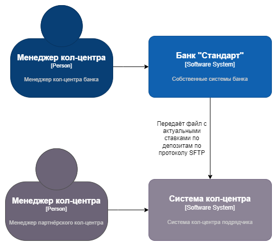
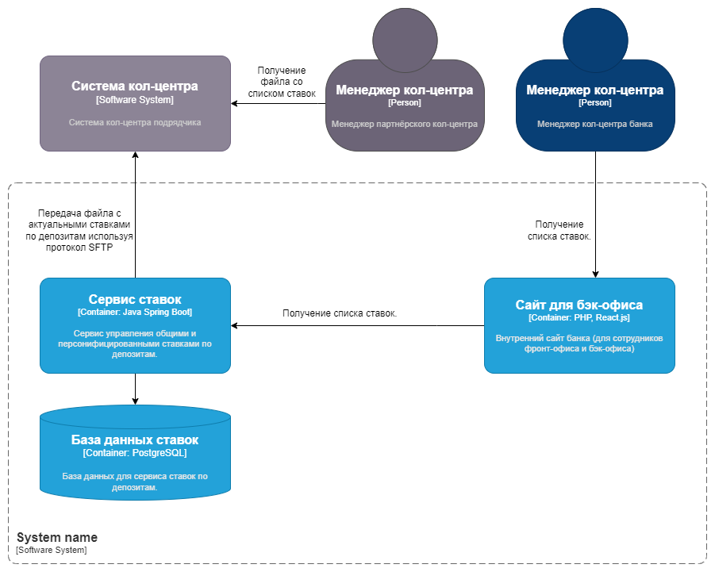

### **Название задачи:** Передача ставок в кол-центр 
### **Автор:** Заливочкин А.В.
### **Дата:** 10.03.2025
### **Функциональные требования**

| **№** | **Действующие лица или системы**             | **Use Case**                                                                                     | **Описание**                                                                                                                       |
|:-----:|:---------------------------------------------|:-------------------------------------------------------------------------------------------------|:-----------------------------------------------------------------------------------------------------------------------------------|
|   1   | Менеджер кол-центра, сайт для бэк-офиса      | Возможность для менеджера кол-центра получать список ставок по депозитам                         | Уже есть в предыдущем ADR                                                                                                          |
|   2   | Сервис ставок, система кол-центра подрядчика | Возможность передавать файлы с актуальными ставками по депозитам в систему кол-центра подрядчика | Сервис ставок при изменениях ставок формирует файле с актуальными ставками и выгружает его по SFTP в систему кол-центра подрядчика |
### **Нефункциональные требования**

| **№** | **Требование**                                                                                                                         |
|:-----:|:---------------------------------------------------------------------------------------------------------------------------------------|
|   1   | В передаваемом файле с актуальными ставками по депозитам должна отсутствовать конфиденциальная информация                              |
|   2   | Нужно обеспечить надёжность доставки файла, например делать повторы попыток передачи при ошибках и недоступности SFTP сервера партнёра |
### **Решение**
Так как подрядчик согласен принимать файлы с актуальными ставками по SFTP, то добавление такой функции в сервис ставок самое простое и быстрое решение.

Диаграмма контекста

Диаграмма контейнеров

### **Альтернативы**
Сотрудники партнёрского кол-центра могут смотреть актуальные ставки на внешнем сайте банка.

**Недостатки, ограничения, риски**

Если сотрудники партнёрского кол-центра не будут чистить SFTP сервер, то там закончится место и новые файлы перестанут поступать.
